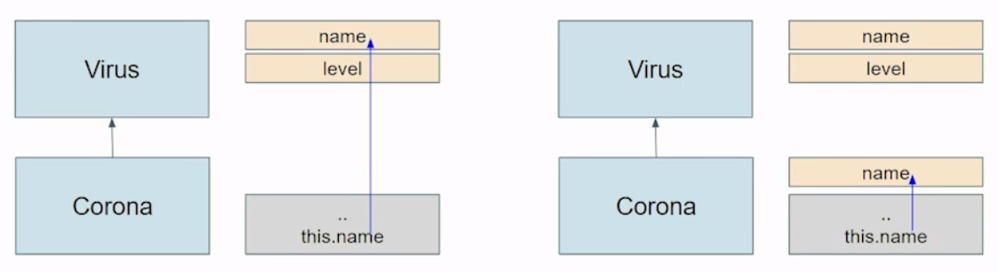
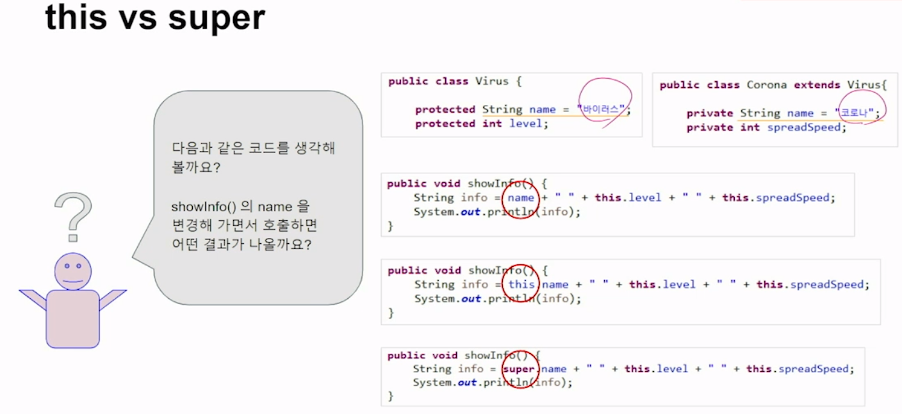

## 6_상속


Java OOP


오늘의 포인트

- Java의 OOP 기본/응용 - 상속
- 코로나 Virus 분석


##### Java Project 만들기

File - New - Java Project

KillCorona


##### package 만들기

src - new - package

lab.minki.corona.virus


#### 코로나 virus 분석

코로나도 virus의 하나니까..

공통적인 부분을 Virus Class로..

Corona Class를 Virus Class를 포함하는 하위 Class로 만들면 될 것 같은데?

그럼 상속(Inheritance)인가??


#### 상속

상속(Ingeritance)은 대표적인 OOP 특징입니다.

어떤 Class B가 다른 Class A의 member variables와 method 를 그대로 받으면 B가 A를 상속받는다라고 한다.

A와 B의 관계를 부모 - 자식 또는 상위 - 하위 개념으로 많이 설명한다.


하나의 부모는 여러 자식을 가질 수 있고, 부모는 또 다른 자식이 될 수도 있다.


어떤 Class가 아무런 상속을 받지 못한 경우,

자동으로 **java.lang.Object** Class가 그 Class의 부모가 된다.


상속을 했다고 해서 물려주는 개념은 아님. 부모가 물려준다 라기 보다는 복사를 해주는 개념.


Object <- Electronic <- Mobile [멤버 변수와 메소드를 다 상속받음.] <- Phone

​																		    					  <- Watch

​																								  <- Tablet


Q) 부모가 여럿일 수는 없나요?

A) 부모 하나 -> 단일 상속, 부모 여럿 -> 다중 상속

Java는 다중 상속을 제한했다.

하나의 부모를 가질 수밖에 없다.

다중 상속 좋은 점도 있고, 복잡도가 증가해서 불편한 점도 있다.

Java 언어는 가벼워야 하고, 단순해야 하고, 모든 곳에서 동작할 수 있는 보편성 가지려 함

복잡도 많은(다중 상속 지원하는) c++과 구별되게 단일 상속 선택


이번 주에 배울 interface, 추상 클래스

-> 다중 상속의 장점 포기하지 않는다. 비슷한 효과 낼 수 있다.


상속받는거 없으면 자동으로 **java.lang.Object** Class가 그 Class의 부모가 된다.

컴파일러 자동으로 하는 거 많쥬

##### 기본 생성자(default constructor) 자동 생성, Object Class 자동 상속, java.lang package 자동 import (System, String class 맘껏 썼쥬)

가비지 컬랙션은 JVM이 한다.


#### 상속 - extends

Java Code로 상속 관계를 표현

extends keyword를 사용한다.


Java는 단일 상속만 가능하다. 오직 한 개의 Class만 extends 가능.


Java는 다중 상속 대신 Interface를 활용한다.


#####  B Class Only 

`public class B {}`

B 클래스만 있다.


##### B Class extends A

`public class B extends A {}`

B 클래스의 부모는 A

A 부모는 누구? A 클래스에 가서 봐야


Object 클래스를 빼놓고는 모두 상속받게 되어 있다.


Q) 우리가 만드는 모든 자바 클래스는 Object 클래스의 하위 클래스이다. O / X

O. 따지고 보면 Object라는 최상위 클래스를 가지게 되어 있다.


##### Test - com.minki - Phone Class 생성(Phone.java)

지난 시간에 이미 했쥬?


Getters, Setters 쉽게 만들기

우클릭 - Source - Generate Getters and Setters


toString 쉽게 만들기

우클릭 - Source - Generate toString()


##### Test - com.minki - FolderblePhone Class 생성

그냥 만들면 Phone이랑 관련이 없으니

extends Phone을 붙여준다. [상속]

```java
public class FolderblePhone extends Phone {

}
```


##### Test - com.minki - InheritanceTest Class 생성

```java
public class InheritanceTest {
	public static void main(String[] args) {
		Phone phone = new Phone();
		phone.setName("Note");
		phone.setColor('B');
		phone.setPrice(20000);
		
		System.out.println(phone);
        
		FolderblePhone fPhone = new FolderblePhone();
		fPhone.setName("Galaxy Folder2");
		fPhone.setColor('A');
		fPhone.setPrice(30000);
		
		System.out.println(fPhone);
	}
}
```


result

```java
Phone [name=Note, color=B, price=20000]
Phone [name=Galaxy Folder2, color=A, price=30000]
```


둘 다 Phone이 찍혀나오는게 아쉽쥬?

밑에 껀 FolderblePhone인데,,

Override(재정의, 내일 배울 예정)

부모와는 다르게 행동하고 싶다.


상속은 잘 받음. 재정의 부분은 아쉽군.


#### 상속 - 자식 Class의 입장

B extends A에서 B Class는 A class의 member variables와 methods를 상속받지만, 동시에 자기 자신만의 member variables와 methods 또한 가질 수 있다.

| Phone | name  | getRealDebt()  |
| :---: | :---: | :------------: |
|       | color | getSalePrice() |
|       | price |                |

​							^

​							|

| FolderblePhone | width  | getSmallSize() |
| :------------: | :----: | :------------: |
|                | height | getLargeSize() |


FolderblePhone.java

```java
package com.minki;

public class FolderblePhone extends Phone {
	
	private int width;
	private int height;
	public int getWidth() {
		return width;
	}
	public void setWidth(int width) {
		this.width = width;
	}
	public int getHeight() {
		return height;
	}
	public void setHeight(int height) {
		this.height = height;
	}
	
	public int getSmallSize() {
		return (this.width / 2) * this.height;
	}
	
	public int getLargeSize() {
		return this.width * this.height;
	}
}
```


InheritanceTest.java

```java
package com.minki;

public class InheritanceTest {
	public static void main(String[] args) {

		FolderblePhone fPhone = new FolderblePhone();
		fPhone.setName("Galaxy Folder2");
		fPhone.setColor('A');
		fPhone.setPrice(30000);
		
		System.out.println(fPhone);
		
		fPhone.setWidth(500);
		fPhone.setHeight(1000);
		
		System.out.println(fPhone.getSmallSize());
		System.out.println(fPhone.getLargeSize());
		
	}
}
```


result

```java
Phone [name=Galaxy Folder2, color=A, price=30000]
250000
500000
```


아쉬운 점) system.out.println(fPhone)을 맨 밑에서 실행해도 width, height 안나온다.


#### 코로나 Virus 분석

Virus Class를 먼저 만들고, 공통적인 항목을 추출하자.

Corona Class가 Virus Class를 상속받도록 하자!

상속 - 화살표를 부모쪽으로 표시한다.

##### 부모 <- 자식


타 바이러스와 공통점

이름(name), 수준(level)


타 바이러스와 다른 점

전파 속도(spreadSpeed)


코딩 규정

Class 생성 시에 Encapsulation 규정 지킬 것!

모든 member variables는 특별한 이유가 없는 한, 모두 private로 선언하고, 외부와 연계되어야 하는 항목들에 대해서만 setters와 getters를 public으로 제공한다.

모든 Test는 lab.minki.corona.app Package에서만 진행한다.


##### KillCorona - src - lab.minki.corona.virus - Virus Class 생성

private String name;

private int level;

getters, setters 자동 생성해주기


##### Corona Class 생성 후 extends Virus

private int spreadSpeed;

getters, setters 자동 생성


##### 테스트할 패키지를 하나 만들자.

src - New - Package

lab.minki.corona.app


##### VirusTest Class 생성

main 안에

Virus virus = new Virus();

Virus 밑에 빨간 밑줄 왜?

VirusTest는 lab.minki.corona.virus 패키지에 같이 있지 않기 때문

-> import를 해줘야

##### -> ctrl + shift + O를 해주면 자동으로 import 해준다.


CoronaTest.java

```java
package lab.minki.corona.app;

import lab.minki.corona.virus.Corona;
import lab.minki.corona.virus.Virus;

public class CoronaTest {
	
	public static void main(String[] args) {
		Virus virus = new Virus();
		virus.setName("MERS");
		virus.setLevel(5);
		
		Corona corona = new Corona();
		corona.setName("Corona"); // 상속
		corona.setLevel(8); // 상속
		corona.setSpreadSpeed(200); // 고유한 내 꺼
	}
	
}
```


#### 코로나 virus Class 만들기

Virus의 name과 level 그리고 Corona의 spreadSpeed를 모두 출력하는 method를 하나 만들어 보자.

showInfo() 추가!

```java
	public void showInfo() {
		String info = this.name + " " + this.level + " " + this.spreadSpeed;
	}
```

name, level에 빨간 줄이 뜬다. (private)

Access Modifier 더 살펴봐야,,


#### default vs protected

private <-> public

public 접근 아무런 제한 없음. universe

가장 강력한 private. 자기 자신 class 안에서만 사용 가능.


default - 아무 것도 붙이지 않는 것.

protected


##### private - default - protected - public 순서


private은 하위 Class가 상속 받아도 직접 접근(Access)할 수 없습니다.

modifier를 생략한 default도 마찬가지.


결국, 하위 Class에서 직접 접근하고자 할 경우, protected로 선언하거나, 상위 Class의 public method를 통해서 접근 가능하다.


#### Protected로 해보자.

##### Virus.java

private -> protected 변경

```java
protected String name;
protected int level;
```


##### Corona.java

```java
	public void showInfo() {
		String info = this.name + " " + this.level + " " + this.spreadSpeed;
//		String info = getName() + " " + getLevel() + " " + this.spreadSpeed;   -> me    
		System.out.println(info);
	}
```


##### CoronaTest.java

```java
	public static void main(String[] args) {
		Virus virus = new Virus();
		virus.setName("MERS");
		virus.setLevel(5);
		
		Corona corona = new Corona();
		corona.setName("Corona");
		corona.setLevel(8);
		corona.setSpreadSpeed(200);
		
		corona.showInfo();
	}
```


result

```java
Corona 8 200
```


#### protected 대신에 Default로 해보자.

##### Virus.java

```java
	String name;
	int level;
```


Virus, Corona -> virus라는 한 패키지 안에 있음 -> 오류가 나지 않는다.

같은 패키지 안에 있으면 상속 관계에서는 서로 접근 가능.


Q) 상속 받을 때 다른 패키지 안에 있는 것도 받을 수 있나요?

A) 가능.


src - new - Class

Package: com.minki

Name: FakeVirus


Virus.java 내용 그대로 copy


```java
public class Corona extends FakeVirus{
    ...
	public void showInfo() {
		String info = this.name + " " + this.level + " " + this.spreadSpeed;
		System.out.println(info);
	}
}
```

요렇게 만들어주면 접근하지 못하는 것 확인 가능(name, level에 빨간 밑줄.)


virus - 같은 패키지 안에 있다 - default 써도 오류가 나지 않는다.

다른 패키지에 있는 것 상속받아 사용 -> default오류 발생! [해보니까 protected로 해주면 오류 안난다.]


##### default

동일 패키지 O

상속 X


##### protected

동일 패키지 O

상속 O


누가 더 너그러워? protected가 더 너그럽다.

protected에 가까운 게 public

default에 가까운 게 private


#### this vs super

super.name과 this.name의 차이

this -> 자기 자신 super -> 부모 객체를 의미합니다.


지금은 this.name을 써도 접근이 되지만[Corona Class에 name을 선언하지 않았기 때문], 원래 super를 쓰는 것이 맞다.




만약 부모 객체에 중복된 memter variables 가 없다면 this를 이용해서 super에 접근할 수도 있다. 하지만 추천하지 않는다. this를 사용하게 되면 나중에 자식 Class에 동일한 member variable이 추가되면 엉뚱한 변수를 가리키게 되기 때문이다.




실수로 "코로나" 를 추가했다면, 어떻게 될까?


순서대로 코로나 / 코로나 / 바이러스 출력


this/super 뺐을 때 / this 넣었을 때 / super 넣었을 때 어떤 것을 의미하는지 확인!


모호한(Ambiguous) 코딩은 하지 말자!


#### 코로나 virus Class 만들기

this나 super는 method에 대해서도 동일하게 사용할 수 있겠지?

부모의 member variable이 private로 되어 있다면 public getter를 이용할 수도 있겠군!


Virus Class가 protected -> 상속 관계에서 접근 가능

this, super method에서도 사용 가능

부모 입장에서 member variables를 Encapsulation 관점에서 생각 해 봤을 때, 2가지 방향이 있다.

1. 부모 클래스가 자체적으로 완성됨. 
   - 자기 자신이 완성된 클래스. 객체로 완성 및 독립적으로 비지니스 로직으로 사용된다.
2. 자식클래스가 도와줘야 완성됨

후자일 경우 직접 자기 자신이 객체로 만들어지지도 않음. protected로 변수 선언 해놓고 그 변수들을 자식 변수에서 접근할 수 있도록 한다 -> 문제 소지 적다.

1 -> protected로 하면 private 보다는 여지가 있다.

자기 자신이 독립적인 Class일 경우에는, private로 가는 것이 일반적


if) Virus Class 멤버 변수 private로 하면? -> name 접근 안되겠지? -> 밑에서 super.name으로 접근 불가능

-> 메소드 제공하자너(setter, getter)

직접 접근하는 게 필요한 것이 아니라, 부모가 가지고 있는 이름을 가져온다.

```java
super.getName()
```

을 이용하면 된다.


Virus 멤버 변수 private로 바꾸기

Virus.java

```java
	private String name;
	private int level;
```


Corona.java

getters, setters 사용

```java
	public void showInfo() {
		String info = super.getName() + " " + super.getLevel() + " " + this.spreadSpeed;
		System.out.println(info);
	}
```


CoronaTest.java

```java
		Corona corona = new Corona();
		corona.setName("Corona");
		corona.setLevel(8);
		corona.setSpreadSpeed(200);

		corona.showInfo();
```


#### 객체를 만들면서 매 번 setters 호출하는 건 불편하군

[바로 위 코드 참고]

생성자를 추가해주자!


기본 생성자는 그대로 두고, Virus의 member variables도 함께 처리하도록 한꺼번에 만들어보자!

부모 member variables가 protected이니 상속받은 변수에 바로 접근 가능하겠지?


```java
public Corona() {}

public Corona(String name, int level, int spreadSpeed ) {
    super.name = name;
    super.level = level;
    this.spreadSpeed = spreadSpeed;
}
```


Virus.java

protected로 변경

```java
	protected String name;
	protected int level;
```


Corona.java

생성자 추가

```java
	public Corona() {}
	
	public Corona(String name, int level, int spreadSpeed) {
		super.name = name;
		super.level = level;
		this.spreadSpeed = spreadSpeed;
	}
```


CoronaTest.java

```java
Corona corona = new Corona("Corona", 8, 200);
```


##### 만약 부모 Class의 member variables가 private라면?

부모 Class의 setters를 사용해도 되고,

생성자가 있다면 생성자를 사용하면 된다!


이전

```java
	public Corona(String name, int level, int spreadSpeed) {
		super.name = name;
		super.level = level;
		this.spreadSpeed = spreadSpeed;
	}
```


이후

```java
	public Corona(String name, int level, int spreadSpeed) {
		super.setName(name);
		super.setLevel(level);
		this.spreadSpeed = spreadSpeed;
	}
```


Virus.java

private로 변경

```java
	private String name;
	private int level;
```


Corona.java

setters 이용

```java
	public Corona(String name, int level, int spreadSpeed) {
		super.setName(name);
		super.setLevel(level);
		this.spreadSpeed = spreadSpeed;
	}
```


직접 접근, setters getters 둘 다 가능하더라도 setters, getters 적극적으로 활용하는 편이 OOP다운 코딩


#### 부모 Class에 생성자가 만들어져 있다면?

부모 Class의 생성자를 이용할 수도 있겠지?

super() 호출하면 되잖아!

##### super() -> 부모 클래스에 있는 생성자 호출

default 생성자 -> 아무런 parameter(argument 인 듯)가 없겠지만,

부모 클래스 안에 parameter 있다 -> parameter 그대로 호출해주면 된다.


이전

```java
	public Corona(String name, int level, int spreadSpeed) {
		super.setName(name);
		super.setLevel(level);
		this.spreadSpeed = spreadSpeed;
	}
```


이후

```java
	public Corona(String name, int level, int spreadSpeed) {
		super(name, level);
		this.spreadSpeed = spreadSpeed;
	}
```


Virus.java

생성자 추가

```java
	public Virus() {}
	
	public Virus(String name, int level) {
		this.name = name;
		this.level = level;
	}
```

public을 protected로 만들게 된다 -> 상속 관계에서만 사용 가능


Corona.java

super의 생성자를 이용하고 싶다.

```java
	public Corona(String name, int level, int spreadSpeed) {
//      super(); // default constructor
		super(name, level); // 부모 클래스 상속자 중 parameter를 갖는 생성자 호출
		this.spreadSpeed = spreadSpeed;
	}
```


##### 만약 default 생성자를 주석처리하면, 오류가 발생한다.

```java
//	public Virus() {}
```

오류나는 코드 중 하나

```java
public Corona() {}
```

Implicit super constructor Virus() is undefined. Must explicitly invoke another constructor


자식 Class의 기본 생성자는 부모 Class의 생성자를 별도로 호출하지 않으면 부모 Class의 기본 생성자를 자동으로 호출한다. 그런데 부모 Class의 기본 생성자가 없으므로 오류가 발생한다.


아무것도 안넣으면 컴파일러가 자동으로 super() 같은거 넣어줌 
(생성자를 호출하는 코드) -> public Virus() {} 찾음 -> 없음 -> 오류


내 클래스를 만들 때 생성자 안넣음 -> 컴파일러가 자동으로 default constructor 넣어줌

내가 extends로 어떤 클래스 상속받음 -> 내가 default constructor 만듦 ->  **컴파일러가 그 안에 자동으로 super()라는 상위 클래스의 default constructor를 자동으로 호출**

상위 클래스에 기본 생성자 없음 -> 오류


Virus.java

기본 생성자 일부러 제거

```java
//	public Virus() {}
```


Corona.java

오류 관찰

```java
	public Corona() {}
```


오류 해결

```java
	public Corona() {
		super("", 0);
	}

// 혹은, 통째로 없애버린다.
```


#### 기본 생성자를 항상 만드는 것이 좋겠다.

나중에 상속받을 수도 있기 때문


```java
	public Corona(String name, int level, int spreadSpeed) {
		this.spreadSpeed = spreadSpeed;
		super(name, level);
	}
```

요렇게 하면 오류가 난다!

Constructor call must be the first statement in a constructor


super()로 부모 Class의 생성자를 호출하는 것은 항상 첫 번째 라인에 와야 한다.

부모가 먼저 만들어져야 하기 때문


상속 완료! 다형성 남아있지만 ㅠㅠ


