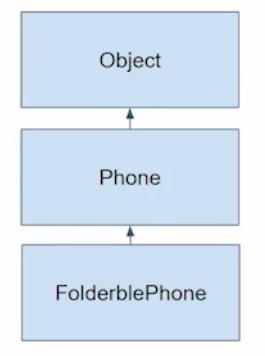

## 7_다형성/제어자`_오전`


Java OOP


다형성


오늘의 포인트

- Java의 OOP 기본/응용 - 다형성, Collection


객체 상태 보여주기 위해 showInfo() 만들어서 사용하지 않고, toString() 사용하는 편이 좋을 듯.


#### Object Class - toString()

System.out.println(parameter)로 전달되는 parameter.toString()을 호출하고, 그 결과를 출력합니다.

parameter로 Virus 객체를 전달해 보면 우리가 원하는 결과와는 다른 결과를 출력한다.

[ parameter 보다는 인자 인듯]


```java
public static void main(String[] args) {
    
    Virus virus = new Virus("UNKNOWN", 5);
    System.out.println(virus);
}
```


virus에 toString()이 호출될 것.

모든 클래스의 최상위 클래스인 Object Class

toString()이란 메소드가 있다.

virus란 Class에 toString()이란 메소드를 만들지 않았쥬?

-> 상속을 받는다.


System.out.println(virus);

virus 객체 전달 -> Object Class에 있는 toString() 메소드 실행(상속받았기 때문)


result

```
lab.minki.corona.virus.Virus@2a139a55`
```

클래스에 대한 정보 @ 주소 레퍼런스에 대한 정보가 출력된다.


#### 코로나 virus Class - 다형성 부여하기

toString()을 내가 원하는 모습으로 만들어 보자!


Virus.java

```java
public String toString() {
    return this.getName() + " " + this.getLevel();
}
```


result

```
UNKNOWN 5
```


##### 부모 Class인 Virus에만 toString()을 상속받았으니, 자식 Class인 Corona는 상속을 받았겠지?

```java
	public static void main(String[] args) {
		
		Corona corona = new Corona("Covid19", 5, 20);
		System.out.println(corona);
	}
```


result

```
Covid19 5
```


위에 getName이랑 getLevel밖에 없쥬?

name, level만 나온다.


##### Corona는 Virus로부터 toString()을 상속받았지만 충분하지 않군.

Corona 스스로 toString()을 따로 가져가야 할 듯?

Corona.java

```java
public String toString() {
    return super.getName() + " " + super.getLevel() + " " + this.spreadSpeed;
}
```


Object에 대해서 Virus가 한 것처럼, Virus에 대해 Corona도 하자


##### 부모 Class와 자식 Class가 같은 method를 가지고 서로 다른 일을 하는군

다른 결과를 보여준다. 와 비슷한 듯.


같은 이름의 메소드가 서로 다른 일을 하는 형태

##### 다형성(Polymorphism)

접두사 poly '많다'라는 뜻

mono와 반대되는 의미 [mono - 하나]


#### 다형성 #1 - methods

하나의 이름으로 여러 개의 형태를 구성할 수 있는 OOP 특징을 다형성(Polymorphism)이라 한다.

Type과 methods로 크게 나누어서 생각할 수 있다. type에 대한 다형성, methods에 대한 다형성

메소드의 다형성부터 살펴본다.

method는 overloading과 overriding 2가지로 다형성을 구현한다.


**overloading **- name이 같아도, parameter가 다르면 별개의 method로 간주함.

​						생성자(constructor)도 동일함.

print()

print(String)

print(String, int)

print(int, String)


**overriding** - 상속 관계에서 부모 Class의 method를 자식 Class에서 재정의할 수 있음.


자바 method signigture.

자바 컴파일러는 이름, 파라미터가 같냐 / 다르냐로 같은 녀석 / 다른 녀석을 구분한다.


Q) 부모 클래스에 getRealDebt(), getRealDebt(int a), getRealDebt(int a, char b) 있고

자식 클래스에 getRealDebt(int a, char b, int c) 있으면 Overriding?


A) 자식클래스에 3개의 파라미터가 있다.

부모로부터 받은 거랑 다르니까 재정의한게 아니죠?

별개의 값을 같은 이름으로 다시 만듦 -> Overloading


Overloading은 어려운 개념 아니지만 Overriding..

크나큰 의미를 갖고 더 많은 일을 하게 되어 있다.


#### 다형성 #2 Type

부모 Type으로 자식 Type의 객체를 Reference할 수 있다.

한 개의 Type으로 여러 하위 Type의 객체를 할당받을 수 있다.




부모 Object o = new Object();

​		 Object o = new Phone(); 도 된다.

​		 Object o = new FolderblePhone(); 도 된다.


왼쪽: 부모 Type

오른쪽: 부모 Type을 포함한 자식 객체가 올 수 있구나!

타입에 대한 다형성


Q) Object o = new Phone(); 하면 Type이 Phone인가요?

A) Type은 Object이다. 왜 그런지는 오늘 공부하면서 배우자.


##### toString()은 재정의(Overriding)에 해당하는 군.


Type에 대한 다형성을 이용해 보자.

Virus Type으로 Corona 객체를 만들고, toString()을 호출하면

Virus의 toString()이 호출되겠지?


```java
	public static void main(String[] args) {
		
		Virus virus = new Corona("Corona", 8, 200);
		System.out.println(virus);
	}
```


result

```
Covid19 5 20
```

Corona Class의 toString()이 호출되었다.

상속받은 Class에서 재정의된 것이 호출되었다.


더 실험해보자

Corona.java

private -> public

```java
public int spreadSpeed;
```


CoronaTest.java

```java
    Virus virus = new Corona("Covid19", 5, 20);
    System.out.println(virus);

//	virus.toString(); // 이게 된다는 얘기이니,,
    virus.spreadSpeed; // 접근 불가
    virus.showInfo(); // 접근 불가
```


뭐지?


Virus.java

toString()


Corona.java

toString() -> 사용 가능

showInfo() -> 사용 불가


##### 아, Virus.java에 있는 것만 쓸 수 있구나

##### Virus virus = new Corona("Covid19", 5, 20);

왼쪽(Virus Class)에 정의되어 있는 것[메소드]만 쓸 수 있다.

부모 클래스(Virus)에 없는 것은 호출할 수 없다.


##### 자식에게 toString()이 없으면?

-> 상속 받아서 있겠죠?

##### 자식에게 toString()이 있으면?

-> 재정의되어있으면 그것이 호출된다.


Overriding 개념 잘 알고 있어야지 어떤 변수로 선언하고 실제로 만들어진 애가 어떤 애일 때, 

거기 있는 변수로는 어떤 것이 호출 가능하고, 오른쪽에서 실제로 호출되는 애는 어떤 게 호출되겠군!


##### 재정의(Overriding)된 method만 부모 Type으로 선언한 변수로 호출하면 호출이 되는 군!


Virus virus = new Virus() - 자기 자신 안에서 끝남, 재정의 고민할 필요 없음

Virus virus = new Corona() - 상속 관계 존재시 Type에 대한 다형성에 의해서

v. 로 호출할 수 있는 것 -> 자기 자신(Virus)에서 정의된 것들만 호출 가능.

Corona에서 있다고 해서 다 갖다쓸 수 없다. (Virus에 없는 거면 못 씀)

만약 Virus에 정의되어 있는데, Corona에 재정의 되어있음 -> 재정의된 것을 사용한다.


이렇게 만든 데엔 이유가 있을 것이다 라고 생각


Memory는 우측(new 뒤)을 보고 만들어진다.

new Virus() -> Virus만큼 allocation이 일어난다.

new Corona() -> Corona만큼 만들어진다.


#### method overriding 연습

toString()은 모든 Class의 상위 Class인 Object에 정의되어 있다.

클래스 정보와 주소정보를 출력한다.

우리가 toString()을 재정의하지 않으면 그대로 상속받게 되고, 재정의하면 재정의된 toString()이 호출된다.

Object <- Virus <- Corona <- ChildCorona

toString() // 1		toString() //2


선언 / 생성

Object x = new Corona(); x.toString();

Object x = new Virus(); x.toString();

ChildCorona x = new Object(); x.toString();

Virus x = new ChildCorona(); x.toString();

2 / 1 / error / 2


Object x = new Corona(); x.toString();

##### 왼쪽 - > 호출 범위

##### 오른쪽 -> 호출 대상


왼쪽 - Object에 선언되어 있는 것밖에 호출 못한다.

자식 클래스에서 새로운 메소드가 만들어졌다고 해서, 호출할 수 있는 게 아니다.

##### 호출할 수 있다 / 없다.


오른쪽 - 실제로 만들어진 녀석.

호출 대상만 생각하면 된다.

##### 부모께 호출되나? 내 께 호출되나?

위에 180개 있어도 상관 없음.

나부터 위로 올라가서 마지막에 재정의된 애만 보면 된다. [올라가다가 제일 처음 마주친 애인 듯]

호출된 애가 안갖고 있는 메소드 -> 걔부터 위로 올라와야..


#### method overriding 연습 하나 더!

왼쪽에서 호출할 수 있다 / 없다 를 따지고,

호출할 수 있다면 오른쪽에서 재정의가 되느냐 까지 확인


ㅁㅁ.ㅇ = new ㅌ

ㅇ.★


ㅁㅁ가 ★를 가지고 있나? (상속받은 것 포함)

★가 재정의되어 있나? (ㅌ부터 위로 올라가면서 확인)


```java
package com.minki;

public class OverridingABCDE {
	public static void main(String[] args) {
		//AA x = new CC(); x.a(); // a 파라미터 없어서 불가
		//CC x = new EE(); x.b(3); // 호출 가능
		//DD x = new BB(); x.b(); // 
		//BB x = new DD(); x.a(3); // 
	}
}

class AA{
	void a(int i) { System.out.println("AA:a(int i)"); }
}

class BB extends AA{
	void b() { System.out.println("BB:b()"); }
}

class CC extends BB{
	void a() { System.out.println("CC:a()"); }
	void b(int i) { System.out.println("CC:b(int i)"); }
}

class DD extends CC{
	void a(int i) { System.out.println("DD:a(int i)"); }
	void b() { System.out.println("DD:b()");}
}

class EE extends DD{
	void a() { System.out.println("EE:a()"); }
	void b() { System.out.println("EE:b()"); }
}
```


#### Override Annotation[주석]

method를 재정의할 때, @Override Annotation 사용을 권장한다.

이 Annotation은 부모 Class의 특정 method를 재정의한다고 compiler에게 명시하는 것이다.

만약 부모 Class에 해당 method가 없는 경우, compile 오류가 발생한다.


A - m1(), m2()

^

|

B - m1() @Override, m2()


A에서 m1()이 사라지면 오류가 발생

m2() 사라져도 오류 안 남 -> 알 수 없다.


OA.java

```java
package com.minki;

public class OA {
	void m1() { System.out.println("OA m1()");}
	void m2() { System.out.println("OA m2()");}
}
```


OB.java

```java
package com.minki;

public class OB extends OA {
	@Override
	void m1() { System.out.println("OB m1()");}
	void m2() { System.out.println("OB m2()");}
}
```


@override 덕분에 OA에 m1()이 없다면 [빼주거나, m1(int a)로 바꾸거나, ...], OB에서 에러가 발생한다 -> 바로 알아챌 수 있다.


m2()는 오류가 안 난다. Overriding 깨져버림. 의도하지 않은 구성이 생긴다.


@Override annotation은 상속 관계에서 자주 보게 될 듯.


#### 의문

상속 관계에서 method overriding 이해 되는 듯.

근데 왜 이렇게 동작하도록 언어를 만들었을까?


하위 클래스 필요하면 하위 클래스 선언하고 만들면 되지...

왜 상위 클래스를 선언하고 하위 클래스를 만들까?

왜 왼쪽 오른쪽 상속 관계를 다르게 해놓고 변수 선언과 만들어진 객체를 만들게 해서 어렵게 할까,,


#### interface - 추상화의 꽃

abstraction

현실 세계에 존재하는 Object 에서 우리가 구축하고자 하는 시스템 관점에서 필요로 하는 것만 가져온다.

필요한 멤버 변수와 메소드를 만드는 작업 - 모델링


추상화 된 클래스들이 상속의 관계를 거치고 나니, 얻는게 꽤 많다.

코드의 재사용, is a 관계 성립 [휴대폰은 전자제품이다. 역은 성립하지 않음]

나랑 비슷한 애들을 상위 클래스로 도출시켜 냄 -> 코드 체계화 가능.

상속 관계에서 Overriding 장치도 가능.


상속 관계에서 그대로 유지가 되는 부분?

메소드는 아님 재정의하고 복잡하자너

멤버 변수들은 그대로 유지가 된다.


상속 관계에서 보다 중요한 것들 -> 멤버 변수

메소드가 안중요하다는 건 아님.

상속 - 코드가 복사되어 내려옴


interface - 기능적 요소에 집중. 어떤 일을 하는 앤데?


상속 - 본질적인 것, 멤버 변수들 그대로 내려옴

interface - 기능적인 요소. functional한 것에 초점


##### 단일 상속(extends)를 선택한 Java는 operation(methods) [function, 기능]의 추상화를 Class와 독립적인 개념으로 interface라고 이름 짓고, 한 Class가 여러 개의 interface를 구현(<u>**implements**</u>)할 수 있도록 했다.


class, interface 완전히 다른 녀석이군.

class - 지금까지 열심히 학습해 온 것

어떠한 class에 기능적인 요소를 추가하고 싶다 -> interface 사용


Q) interface 없이 class에 기능적인 요소를 추가할 수 없나요?

A) 됩니다. 없어도 가능. method 추가하면 기능이 생긴다.

Q) 왜 굳이 Class와 상관 없는 interface를 따로 만들어서, 별도로 기능적인 요소만을 가지는 개념을 만들었을까?


interface를 **구현**한다 고 표현

클래스 -> extends

상속받는 거 말고 나의 기능적인 요소!

A에 표현되어 있는 기능적인 요소들을 가져간다.(implement)

난 A를 구현하고 있다.


부모 클래스 -> extends

하나밖에 못가져옴, is a 관계 성립 -> 부모 클래스가 가지고 있는 멤버 변수와 메소드들을 다 상속받는다.

재정의하고 싶은 게 있으면 재정의하면 됨.


만약, 부모로부터 상속받은 거 외에 내가 기능적인 요소를 가지고 싶다.

어떻게 해?

부모에게 -> 기능적인 요소 A 추가 바랍니다.

부모 -> 자기 입장이 있다. 내가 왜 구현해야돼? 니가 구현해

A 기능 구현하고 싶으면 내 쪽으로 가져와서 해야..


A 기능 구현

A에 있는 메소드를 내가 가지고 있다,,

상속과 비슷하나 조금 다름.


implement A

부모로부터 받은 것 + A에 명시되어 있는 기능적인 요소 추가로 가진다.


interface B에 대한 기능적인 요소를 또 갖고싶다면?

implement A, B


상속은 하나만 받았지만, interface는 여러 개 받을 수 있다. (구현)

implement A, B, C 도 가능.


부모 extends

멤버변수 말고, 또다른 기능적인 특징들을 가져가려면

내가 만들 수 있겠죠?

자바에선 interface 가 OOP적으로 나은 듯.


A 기능 구현하고 싶음 -> implements A

다중 상속과 비슷한 기능을 여러 개 구현 -> interface를 자바가 제공.


##### interface에는 관련된 methods들을 기술하는 데, 선언부만 기술하고, 구현부는 없다.

m(); 이렇게 끝

m() {} 이 부분이 없다.


구현부가 없으면 implements한 뒤 구현부는 내가 작성해야.

내가 기능적인 부분을 구현하겠다.


##### 상속(inheritance)은 본질적으로 재사용(reuse)인데 반해, 인터페이스(interface)는 본질적으로 규약, 약속이라고 생각하면 된다.


? 내가 필요하면 메소드 그냥 만들어 쓰면 되지 않나,,

왜 interface implement? 하고 나서 만들어야 하나? 

구현된거도 하나도 없고 내가 구현해야 하는데,,

아까 상속 왼쪽 오른쪽 클래스 다를 때랑 연장선으로 의구심을 가져야

오후에 해소 가능


interface, method overriding 이해하면 큰 산을 넘은 것.

뒤는 쉽다.

interface 이해 시 왜 method overriding이 이렇게 만들어졌고 interface를 통해 이런 것들이 가능해지는구나 깨닫게 된다.


interface 이해시 중급자 이상 수준이 아닌가 싶다.


오전 - 다형성

상속, 타입 ,메소드


오후 - interface