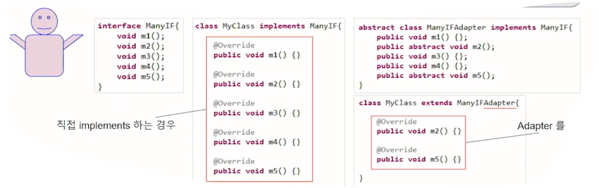

## 8_다형성/제어자`_오후`


Java OOP


#### interface - 추상화의 꽃

상속 - 나와 본질적으로 같은 성질. 조금은 다른. is a

멤버 변수, 메소드 뒤섞여있을 수 있고 자바에선 단일 상속만 가능

상속 외에 부가적인 기능을 가져가려 함

부모에게 추가로 요구 / 자기가 추가

Java - interface라는 독특한 추상화 방법 제공

interface - 기능적인 꾸러미

다중상속하듯이 사용할 수 있다.


Phone <-(extends) FolderblePhone

Folder <-(implements) FolderblePhone


Folder -> fold(); , open();

Body가 구현되어있지 않다.

implements -> 내가 저 기능들을 구현할께!

Body 부분은 FolderblePhone이 만들겠다.


상속과는 완전히 다른 개념. 이미 가지고 있는 무언가를 갖는 느낌이 아님

interface -> 내가 무언가 만들어야 한다.

기능을 실제로 **구현**해야.


FolderblePhone이 Phone을 상속받고, Folder를 구현한다.


com.minki우클릭 -> new -> interface

Folder.java

```java
package com.minki;

public interface Folder {
	public void fold();
	public void open();
}
```

Phone.java

```java
package com.minki;

public class Phone {
	private String name;
	private int price;
    // getters, setters 생략
}
```

FolderblePhone.java

```java
package com.minki;

public class FolderblePhone extends Phone implements Folder {

}
```

에러 발생

The type FolderblePhone must implement the inherited abstract method Folder.fold()


interface IF를 구현하는 Class C는 interface IF에 있는 모든 추상(abstract) method를 구현할 의무를 가진다.


화면에 FolderblePhone 빨간 밑줄 -> 마우스 갖다 댐 -> Add unimplemented methods 클릭

fold(), open(), @override 자동으로 생성


override는 상속관계에서 재정의인데 interface에서도 똑같이 정의되나?

맞습니다. 동일하게 적용


#### 코로나 virus Class - 다형성 부여하기

Java에서 interface는 추상 methods들의 집합이구나. member variables보다 methods에 집중하는 개념이고.

[추상 메소드(abstract methd) - 자식 클래스에서 반드시 오버라이딩해야만 사용할 수 있는 메소드.]

[상속받는 자식 클래스가 반드시 추상 메소드를 구현하도록 하기 위해 사용]

[http://tcpschool.com/java/java_polymorphism_abstract]

근데 왜 implements를 그 Class에서 하고, 여러 개의 interface를 구현할 수 있지?


혹시 부모 Class처럼, Interface Type으로 변수를 선언하고 객체를 Reference?? 그리고 그 Interface에 기술된 method들을 호출??


왼 쪽에 Interface Type, 오른 쪽에 Interface Type을 구현한 객체가 온다.

IF o = new ㅁ()

ㅁ가 IF를 implements한 녀석

o를 가지고 IF에 있는 메소드들만 호출할 수 있도록.

ㅁ엔 그것을 구현한 애들이 body를 가지고 있다.


만약, 그게 가능하다면 A와 B는 I라는 Interface를 서로 규정하고, A는 그것을 구현하고, B는 I Type으로 객체를 Reference할 수 있군. B 입장에선 굳이 A를 상속받을 필요도 없고,  A가 그걸 어떻게 구현했는지 알 필요도 없고!


A, B, I

A가 I를 구현

A a = new A()

A라는 클래스 전체에 대해 referencing

B입장) A까지는 필요없고 I까지만 쓰고 싶은데,,

-> 그게 가능하다.

I i = new A()

요 변수로 인터페이스에 있는 메소드를 호출할 수 있다.

A는 interface I를 implements하고 있으니까

A에 있는 인터페이스에 해당하는 메소드가 실행된다.


OOP는 많은 Class들이 다양한 의존 관계를 통해 문제를 해결한다.

만약, A Class가 B Class의 <u>어떤 methods</u>를 필요로 할 경우를 생각해 보자.


A는 B의 전부를 원하는 게 아니라, 필요한 <u>어떤 method의 수행</u>을 원한다. 그 method가 내부적으로 어떻게 구현되어 있는지도 관심이 없고, 관심을 가져서도 안된다.


B 역시 A가 필요로 하는 method에 대해 모든 걸 노출하고 싶지 않다.

호출 방법과 결과에 대한 기본적인 사항만 공유되기를 바란다.

**Interface**는 여기에 딱 맞는 개념이다. [A와 B의 약속]


A는 자신의 Code에서 B type 대신 Interface Type으로 B 객체를 Reference 하고 Interface에 있는 method만 호출하면 된다.


interface는 자신만의 객체를 만들 수 없다

또한, interface에 명시된 method에 대해서만 호출이 가능하다.


```java
public static void main(String[] args) {

    Folder f = new Folder() // 자신의 객체를 생성할 수 없다.

    Folder folder = new FolderblePhone();

    folder.open();
    folder.fold();

    folder.getLargeSize();	// Folder 에 선언된 method 만 호출이 가능하다.
}
```


나중에 JDBC 개념 배운다.

DB - Oracle, MySQL


java APP -> Oracle에서 제공하는 API 사용

MySQL에서도 API 제공. 둘이 API 다르다.


interface라는 개념이 JDBC라는 것을 통해서 나온다.


insert select 왤케 서로 달라,,

그러지말고 DB에서 사용하는 Interface 만들자.

select(), insert(), .. ,getCollection()

니네는 이 Interface를 implements하는 애를 만들어

OracleJDBC

MySQLJDBC

니네가 Interface를 implements해서 제공해

니네가 내부적으로 어떻게 구현하는지는 관심없어 니네 너무 복잡해

우리는 Interface대로 쓸꺼니까 Interface를 implements한 애를 만들고,

그걸 .jar 파일로 갖고와

그 안에 클래스들은 니들 맘대로 만들어 신경 안 써

그 안에 Interface를 구현한 녀석이 누구인지만 알려줘


jar 안에 JDBCDriver가 Interface를 implements한 애여

우리는 JDBCDriver만 갖다쓰면 된다.


interface가 실제에서 사용되는 한 예


사용하고자 하는 쪽이 실제 구현한 쪽에 대해 세세하게 알 필요 없다.

Java App이 DB에게 상속받을 순 없다. 본질적으로 다른 녀석이여


상속과 interface를 동일시하면 안돼

상속 - is a, DNA적으로 비슷

interface - 완전히 이질적인 애들


부가적인 게 필요할 때

내가 구현하던지

그런 것을 구현한 것을 내가 갖다쓰던지


그 사람들(다른 팀, MySQL 등등)이 만든 인터페이스만 보고 사용한다.

내용, 구현 부분은 알 필요가 없다. 잘못되면 그 사람의 책임

인터페이스 구현 -> 사용자, 구현자

구현자 -> interface implements하고 interface를 사용자와 share

사용자 -> 내부 구현 볼 필요 없이 interface에 있는 것만 보고 열심히 코딩

결과 이상하면 걔들이 알아서 고친다.


이미 Java를 접한 분들은, Java Core Library에서 제공하는 것들 외에, 추가적으로 어떤 기능이 필요한 경우 대부분 .jar 파일 형태로 외부로부터 제공받는다.


이 때, 그 jar의 내부를 보면 알 수 없는 복잡한 구조와 .class 파일들로 구성된 것이 일반적이다.


여러분은 그걸 어떻게 사용하는가? 보통 API Document라는 걸 제공한다. 어떤 Type으로 변수를 선언하고 필요한 객체를 어떻게 얻고, 나머지는 그 Type의 변수로 호출할 수 있는 method들의 명세를 제공받는다.


여러분이 사용하는 그 Type이 특별한 경우를 제외하고 모두 Interface로 선언되어 있다


거꾸로 여러분이 .jar를 제공할 때도 마찬가지이다. 실제 구현 코드는 숨기고 제공할 기능만 Interface로 만들고 그 Interface만 노출시킨다.


#### interface - default method

java 8버전부터 default method라는 Body를 가진 method가 interface에 추가되었다.

이로 인해, 본래의 interface 의미가 조금 퇴색되었다는 읙ㄴ이 많고, 원래 있던 추상 Class의 역할도 애매해졌다. 그러나 개발자의 편의는 증대되었다.


Folder.java (interface)

```java
public interface Folder {
	public void fold(); // 추상 메소드들
	public void open();
	
	default public void powerOn() { // default로 추상 메소드가 아님을 알려줌.
		System.out.println("Power On!");
	}
}
```


FoldetblePhone.java

```java
public class FolderblePhone extends Phone implements Folder {

	@Override
	public void fold() {
		System.out.println("fold");
		
	}

	@Override
	public void open() {
		System.out.println("open");
	}

}
```


// 왼쪽 - 호출 범위 [me - 기준?]

// 오른쪽 - 호출 대상

PhoneTest.java

```java
public class PhoneTest {
	public static void main(String[] args) {

		Folder folder = new FolderblePhone();
		
		folder.powerOn(); // 이 클래스[PhoneTest]에서 구현하지 않아도 상속받는 것처럼 그대로 받는다.
        // overriding하지 않으면 그대로 받는다.
        
		folder.open();
		folder.fold();
	}
}

```


원래 Interface -> Only 추상 메소드(바디가 없는, 구현체가 없는 메소드)

Java 8부터 구현체가 있는 default 메소드도 가지게 되었다.

implements도 사용 가능, 당연히 override도 가능.


#### 추상 Class

추상 Class는 Class이나 추상 method를 가져, 스스로 객체를 만들지 못한다. abstract keyword를 class 앞에 붙여 표시한다. 추상 method 앞에 abstract keyword를 붙인다.

추상 Class를 상속받는 Class는 Interface를 구현하는 Class처럼 추상 method의 구현 의무를 가진다. 단일 상속 기준에 의해 추상 Class를 상속하면, 다른 Class를 상속할 수 없다.


AbstractFolder.java

```java
public abstract class AbstractFolder {
	public abstract void fold();
	public abstract void open();
	
	public void powerOn() {
		System.out.println("Power On!");
	}
}
```

default method가 나오면서 추상 클래스, interface가 애매해졌다.

추상 클래스의 역할이 약간 줄어들었으나, 여전히 많이 사용되는 중


위의 코드가 interface로 바뀌면, abstract가 빠지고 powerOn에 default가 들어간다.


추상 method가 많은 interface를 사용할 경우, Class가 직접 interface를 implements할 경우 사용하지 않는 method까지 모두 구현(dummy)해야 하는 불편함이 있었는데, 이를 해소하는 용도로 많이 사용되었다.

Java API의 많은 추상 Class 대부분이 ~Adapter라는 이름을 가지고 있는데, 위의 용도로 사용되는 것들이다.




Interface method 5개 추상 메소드

2개 정도만 기능 활용하고 싶어도 나머지 다 구현해야

일부만 구현해서 나머지 사용하고 싶어도 안 됨

API - Adapter 형식으로 추상 클래스들이 좀 있다.

대신 interface를 implement해서 일부가 바디를 가지도록 만들어준다.

Interface 직접 갖다쓸 애는 직접 하세요(중간)

만약 interface 직접 구현 힘드시면 상속을 통해 Adapter를 구현하셔도 됩니다. 2가지를 제공


MyClass 입장에서 Interface를 직접 implement해서 뭔가를 할 수도 있지만,

Adapter를 이용해서 필요한 것만 implement해서 쓸 수 있다.


interface

사용자, 제공자 측면에서 중간에 약속을 한다.

사용자 interface 이해 / 제공자 interface 구현

ㄴ interface에 기술된 대로 사용하면 된다.


추상 클래스 - 클래스인데 abstract라는 키워드가 붙었다.

interface처럼 추상 메소드를 가지는 구조를 가지고 있다.

8버전부터 default method 추가 -> 추상 메소드와의 역할 애매


AbstractClassTest.java

```java
public class AbstractClassTest {

}

interface ManyIF{
	void m1();
	void m2();
	void m3();
	void m4();
	void m5();
}

//	class MyClass implements ManyIF{
//
//@Override
//public void m1() {}
//
//@Override
//public void m2() {}
//
//@Override
//public void m3() {}
//
//@Override
//public void m4() {}
//
//@Override
//public void m5() {}
//
//}


//abstract class ManyIFAdapter implements ManyIF{
//public void m1() {};
//public abstract void m2();
//public void m3() {};
//public void m4() {};
//public abstract void m5();
//}
//
//class MyClass extends ManyIFAdapter{
//
//@Override
//public void m2() {}
//
//@Override
//public void m5() {}
//
//}
```


ManyIF 앞에 void밖에 없다.(access modifier가 없다.)

구현 Class 안에는 public이 있다.

public 을 빼면?


interface 안의 method는 access modifier를 생략하면 public이 된다(default X)

method를 override할 경우, 부모의 access modifier보다 visibility를 줄일 수 없다.

좀 어려운 내용이지만 꼭 기억!


#### instanceof


